# Блок ПАМЯТЬ И ДАННЫЕ — карта связей

Карта всех таблиц блока и связей между ними. Полный DDL по каждой колонке — в
`ПАМЯТЬ-схема-v1.md`. Таблицы волны 1 уже созданы в проде (пустые), так что правка по
итогам этой ревизии — дешёвый `ALTER`.

---

## Составной ключ клиента, протянутый через ВСЕ хранилища

Каждая персональная таблица несёт **две колонки** `bot_id text` + `user_id bigint`, где
`bot_id REFERENCES clients(bot_id)`. Пара `(bot_id, user_id)` — единый ключ изоляции арендатора
и клиента. Мост к существующей памяти диалога: `session_id = bot_id || ':' || user_id`
(в `n8n_chat_histories` ключ — именно эта строка, напр. `gymak:255171226`).

| Хранилище | Таблицы | Ключ клиента |
|---|---|---|
| 1 Профиль | `client_profile` | PK `(bot_id, user_id)` |
| 2 Измерения | `measurement` | `(bot_id, user_id)` + surrogate `id` |
| 3 Журналы | `workout_session` → `workout_entry`, `food_log` | `(bot_id, user_id)` на заголовках |
| 4 Коллекции | `allergen`, `food_preference`, `medication`, `condition`, `injury`, `exclusion` | `(bot_id, user_id)` |
| 5 Артефакты | `recipe` → `recipe_ingredient`, `research_report`, `plan` | `(bot_id, user_id)` |
| 6 Производная | `client_summary`, `extraction_state`, `chat_history_archive` | `(bot_id, user_id)` |
| Справочники | `activity_library`, `freshness_policy` | — общие, без клиента |

Единый ключ везде — это и GDPR-seam: экспорт/удаление клиента = проход по таблицам с
`(bot_id, user_id)`.

---

## ER-карта

```mermaid
erDiagram
  clients ||--o| client_profile : "1-1"
  clients ||--o{ measurement : "1-N"
  clients ||--o{ workout_session : "1-N"
  workout_session ||--o{ workout_entry : "header-lines"
  activity_library ||--o{ workout_entry : "activity_id"
  clients ||--o{ food_log : "1-N"
  clients ||--o{ recipe : "1-N"
  recipe ||--o{ recipe_ingredient : "1-N"
  recipe ||--o{ food_log : "recipe_id"
  clients ||--o{ allergen : "1-N"
  clients ||--o{ food_preference : "1-N"
  clients ||--o{ medication : "1-N"
  clients ||--o{ condition : "1-N"
  clients ||--o{ injury : "1-N"
  clients ||--o{ exclusion : "1-N"
  injury ||..o{ exclusion : "source_ref"
  condition ||..o{ exclusion : "source_ref"
  medication ||..o{ exclusion : "source_ref"
  allergen }o..o{ recipe_ingredient : "code-check"
  clients ||--o{ research_report : "1-N"
  research_attempts ||--o| research_report : "execution_id"
  clients ||--o{ plan : "1-N"
  clients ||--o| client_summary : "1-1"
  clients ||--o| extraction_state : "1-1"
  clients ||--o{ chat_history_archive : "1-N"
  clients ||--o{ n8n_chat_histories : "session_id"
```



Сплошная линия — FK в БД. Пунктир (`..`) — **мягкая** связь: не FK, а ссылка/проверка на
уровне кода (`exclusion.source_ref`, сверка аллергенов). `activity_library` и `freshness_policy`
общие (без `bot_id`).

---

## Ключевые поля по таблицам (типы; PK/FK)

**1 · client_profile** (одна строка/клиент; читается каждое сообщение)
`bot_id text FK`, `user_id bigint` — **PK вместе**; `disciplines jsonb` (список
`[{discipline,goal,priority}]`); `current_weight_kg numeric` + `current_weight_on date`
(снимок ряда); `onboarding_done bool`; `sensitive bool`.

**2 · measurement** (универсальный ряд)
`id bigint PK`; `bot_id text FK`, `user_id bigint`; `measured_on date`; `metric text`;
`value numeric`; `unit text`; `source text` (client/extracted/device); `sensitive bool`.
Индекс `(bot_id, user_id, metric, measured_on DESC)`.

**3 · workout_session** → **workout_entry** (мультиформат)
session: `id bigint PK`; `(bot_id, user_id)`; `performed_on date`; `session_type text`;
`duration_min int`; `perceived_effort numeric`.
entry: `id bigint PK`; `session_id bigint FK`; `activity_id int FK→activity_library`;
`kind text` (strength/cardio/other); силовые `set_no,reps,weight_kg,rpe`; кардио
`duration_s,distance_m,pace_s_per_km,hr_avg`; `extra jsonb`.

**3 · food_log**
`id bigint PK`; `(bot_id, user_id)`; `eaten_on date`; `meal_type text`; `kcal,protein_g,
fat_g,carb_g numeric`; `recipe_id bigint FK→recipe` (nullable).

**4 · Коллекции**
`allergen`: `substance text`, `severity text` (allergy/intolerance), `confirmed bool`.
`food_preference`: `item text`, `stance text` (like/dislike).
`medication`: `name,dose,schedule,reason`, `started_on,ended_on date`, `active bool`.
`condition`: `name text`, `since date`, `active bool`.
`injury`: `area text`, `status text` (active/rehab/resolved), `since,resolved_on date`.
`exclusion`: `scope text` (load_tag/activity/ingredient/other), `value text`,
`source_type text`, `source_ref bigint`, `confirmed bool`, `active bool`, `since,until date`.
Все — `id bigint PK`, `(bot_id, user_id)`, медицинские несут `confirmed` и `sensitive`.

**5 · recipe** → **recipe_ingredient**
recipe: `id bigint PK`; `(bot_id, user_id)`; `title text`, `title_norm text` (дедуп —
UNIQUE `(bot_id,user_id,title_norm)`); `*_per_serving numeric`; `tags jsonb`; `source text`
(bot/client/found); `status text` (saved/favorite).
ingredient: `id bigint PK`; `recipe_id bigint FK`; `item text`, `amount numeric`, `unit text`.

**5 · research_report / plan**
report: `id bigint PK`; `(bot_id, user_id)`; `execution_id text FK→research_attempts`;
`topic,summary,report_text text`; `pdf bytea`; `sources jsonb`.
plan: `id bigint PK`; `(bot_id, user_id)`; `kind text` (training/nutrition); `content jsonb`;
`active bool`.

**6 · client_summary / extraction_state / chat_history_archive**
summary: PK `(bot_id, user_id)`; `summary_text text`; `covers_through timestamptz`.
extraction_state: PK `(bot_id, user_id)`; `last_message_id int`; `last_extracted_at timestamptz`.
archive: `id bigint PK`; `(bot_id, user_id)`; `orig_id int`; `session_id text`; `message jsonb`.

**Справочники**
`activity_library`: `id int PK`; `name text UNIQUE`; `category text`; `load_tags text[]`
(gin-индекс); `equipment,aliases text[]`.
`freshness_policy`: `metric text PK`; `max_age_days int`.

---

## Разбор связей, которые ты просил

### 1) Измерения — одна таблица держит вес, анализы, произвольные метрики

Форма записи всегда одна: `дата → метрика → число → единица`. Тип метрики — **строка**, а не колонка,
поэтому новая метрика не требует смены схемы.

| id | bot_id | user_id | measured_on | metric | value | unit | source | sensitive |
|---|---|---|---|---|---|---|---|---|
| … | gymak | 255171226 | 2026-07-28 | `weight` | 82.5 | kg | client | f |
| … | gymak | 255171226 | 2026-07-10 | `ldl` | 3.1 | mmol/L | extracted | **t** |
| … | gymak | 255171226 | 2026-07-28 | `waist` | 84 | cm | client | f |
| … | gymak | 255171226 | 2026-07-28 | `coffee_cups` | 3 | count | client | f |

Читается ТОЛЬКО по датам/агрегатами: последнее (`ORDER BY measured_on DESC LIMIT 1`), среднее за
неделю, ряд за месяц. Никогда целиком — это и есть решение проблемы токенов. «Веди трекинг кофе» =
новые строки с `metric='coffee_cups'`, схема не меняется.

### 2) Мультиформатный журнал — силовая (подходы) и кардио (дистанция/темп/пульс) в одной структуре

`workout_session` = заголовок тренировки; `workout_entry` = строки. Колонка `kind` — переключатель
формы, лишние поля остаются NULL.

**Сессия #12** — силовая (`session_type='strength'`, 65 мин):
| entry | activity_id | kind | set_no | reps | weight_kg | rpe | distance_m | pace | hr |
|---|---|---|---|---|---|---|---|---|---|
| 1 | Присед | strength | 1 | 10 | 80 | 8 | — | — | — |
| 2 | Присед | strength | 2 | 8 | 85 | 8.5 | — | — | — |
| 3 | Присед | strength | 3 | 6 | 90 | 9 | — | — | — |

**Сессия #13** — кардио (`session_type='cardio'`, 40 мин):
| entry | activity_id | kind | set_no | reps | weight_kg | distance_m | pace_s_per_km | hr_avg |
|---|---|---|---|---|---|---|---|---|
| 1 | Бег | cardio | — | — | — | 8000 | 300 | 150 |

Смешанная тренировка (силовая + добивка на дорожке) — просто строки с разным `kind` под одной
сессией. Агрегаты раздельны: объём `Σ(reps×weight_kg) WHERE kind='strength'`, километраж
`Σ(distance_m) WHERE kind='cardio'`. Одно не ломает другое.

### 3) Таблица исключений — связь с травмами/состояниями/препаратами

`exclusion` — единый список всего запрещённого, из любого источника. Проверяется КОДОМ перед
выдачей рекомендаций. Связь с первоисточником — `source_type` (откуда) + `source_ref` (id записи).
Это **мягкая** ссылка (не жёсткий FK: источники разные), но она позволяет гасить исключения при
изменении первопричины.

| id | scope | value | source_type | source_ref | confirmed | active | since | until |
|---|---|---|---|---|---|---|---|---|
| 1 | `load_tag` | `impact` | injury | injury#7 (колено) | t | **t** | 2026-07-20 | — |
| 2 | `activity` | `back squat` | client_request | — | t | t | 2026-07-15 | — |
| 3 | `ingredient` | `grapefruit` | medication | medication#3 | t | t | 2026-07-01 | — |
| 4 | `load_tag` | `overhead` | condition | condition#2 (плечо) | f | t | 2026-07-22 | — |

- `scope='load_tag'` + `value='impact'` блокирует **все** активности с этим тегом (бег, дорожка,
  футбол, падл) разом — теги из `activity_library.load_tags`.
- `scope='activity'`/`ingredient` — точечно, по имени.
- **Жизненный цикл:** травма#7 закрывается (`injury.status='resolved'`) → её исключения гасятся
  `active=false` (не удаляются — аудит). Пока `confirmed=false` (строка 4) — код может трактовать
  как мягкое предупреждение, а не жёсткий блок (порог настраивается).

### 4) Рецепты ↔ аллергены — детерминированная проверка

Связь НЕ через FK, а через **список ингредиентов** и сверку кодом. Поэтому ингредиенты и лежат
отдельной таблицей-списком, а не текстом.

```
allergen(client): substance='арахис', severity='allergy'
recipe_ingredient(recipe#5): item='арахисовая паста', 'мука', 'сахар'

Code-проверка перед выдачей рецепта#5:
  нормализуем каждый item и каждый substance (регистр, синонимы) →
  'арахисовая паста' ⊃ 'арахис' → СОВПАДЕНИЕ → выдача рецепта#5 БЛОКИРУЕТСЯ.
```

Не доверяем памяти модели: матч делает код по строкам (подстрока/синонимы/нормализация), severity
`allergy` = жёсткий блок, `intolerance` = предупреждение. Ингредиенты списком → каждый проверяется
детерминированно.

### 5) Производная память — «извлечённые факты + выжимка»

Важный момент дизайна: **отдельной таблицы «факты» нет**. Извлечение раскладывает факты по
типизированным хранилищам, а прозой остаётся только выжимка. Так факт сразу попадает туда, где он
запрашивается агрегатом/проверкой, а не в общий мешок.

```
Ночной разбор среза переписки (по extraction_state.last_message_id):
  число («вес 82») ───────────► measurement (source='extracted')
  медфакт («аллергия на орех») ► allergen/condition/injury/medication (confirmed=false → бот подтвердит)
  предпочтение («не люблю рыбу»)► food_preference
  смысл/договорённости ────────► client_summary.summary_text (проза, перезаписывается)
  сырые сообщения старше окна ─► chat_history_archive, затем удаление из активной памяти
```

- `client_summary` — одна строка/клиент: `summary_text` (сжатый дайджест) + `covers_through`
  (по какой момент учтено).
- `extraction_state` — служебный водяной знак: `last_message_id`, `last_extracted_at`.
- `chat_history_archive` — сырьё, вынесенное из `n8n_chat_histories`; порог архивации ОБЯЗАН быть
  ≥ окна агента (узел памяти читает последние N).
- Итог для агента = последние N реплик + `client_summary` + профиль + точечные запросы в ряды/коллекции.
  Не год чата.

---

## Что подтвердить на этой ревизии

1. Единый ключ `(bot_id, user_id)` во всех хранилищах + мост `session_id` — ок?
2. Исключения: `source_type`+`source_ref` как мягкая ссылка, гашение через `active=false` при
   изменении первопричины — ок?
3. Рецепты↔аллергены: проверка кодом по списку ингредиентов, не FK — ок?
4. Производная память БЕЗ отдельной таблицы «факты» — факты сразу в типизированные хранилища,
   прозой только `client_summary` — ок? (Это ключевое решение.)
5. Мультиформатный журнал через `kind` + NULL-поля — ок?
6. Измерения одной таблицей через `metric text` — ок?

После твоего ок по карте — возвращаюсь к ГО на профиль (подэтап 2).
